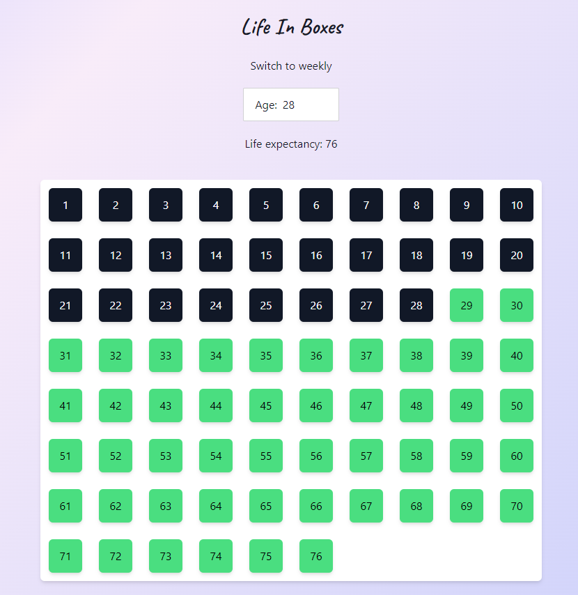
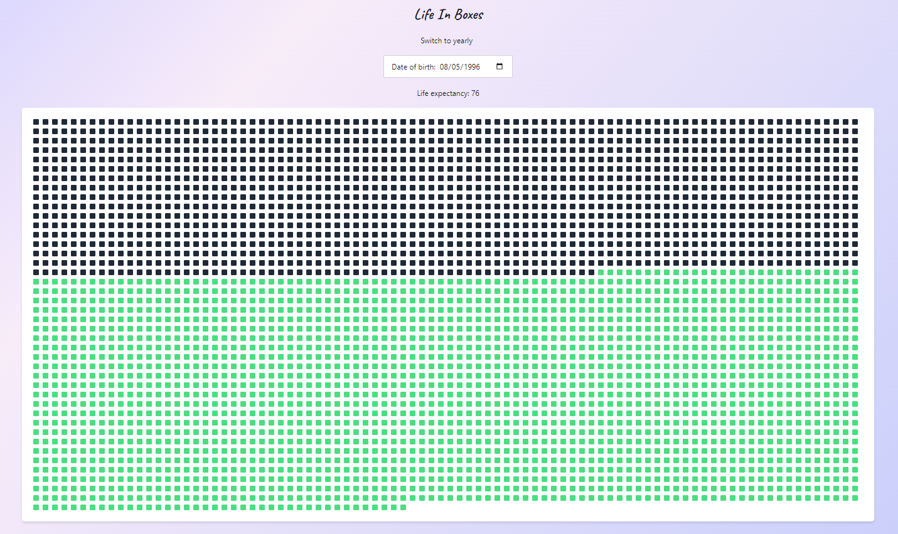

# 🎉 Life in Boxes

**Life in Boxes** is a minimalist yet powerful visual tool designed to provide a clearer perspective of a lifetime by representing it with boxes. Each box symbolizes either a week or a year of life, depending on the mode selected. The app also projects the remaining life based on the standard life expectancy, currently set at 76 years.

## 🌟 Purpose of this Application

The primary goal of **Life in Boxes** is to offer a fresh way to visualize the passage of time and emphasize its fleeting nature. Key purposes of the app include:

- Providing a **visual representation** of past and remaining life to create an intuitive sense of time.
- Encouraging **reflection** on the time that has passed and fostering greater awareness of the present moment.
- Promoting a **mindful approach** to time management and life decisions by illustrating the limited amount of time left.
- Offering an interactive tool to **recall significant periods** of life by exploring specific weeks and reflecting on how life has evolved.
- Serving as a **motivational tool** to inspire intentional living and prioritization of meaningful activities.

This app was inspired by paper versions of "life boxes" often seen online, but enhances the experience with an interactive, digital format to help users appreciate the present and reflect on the past.

## 📅 Yearly Mode

In **Yearly Mode**, each box represents **one year** of life.

- **Black boxes**: Represent past years.
- **Green boxes**: Represent future years, based on the life expectancy of 76.

This mode provides a broad overview of life, offering insight into yearly progress.



## 🗓 Weekly Mode

In **Weekly Mode**, each box represents **one week** of life.

- **Black boxes**: Represent past weeks.
- **Green boxes**: Represent future weeks.

When hovering over a week box, the app displays the week number and its starting date, beginning from the birthdate provided. Since each new week starts on the same day as the birthdate, the weekly mode offers a detailed, granular perspective on life's progress.

**Note:** The start of each week is aligned with the birthday provided. For example, if the birthdate falls on a Tuesday, each new life week will start on a Tuesday.



## 🛠 Technology Stack

The application is built using modern web technologies to ensure efficiency and simplicity:

- **Svelte**: Provides a highly reactive and optimized user interface.
- **Tailwind CSS**: Enables utility-first, responsive styling.
- **DaisyUI**: Offers enhanced, ready-to-use user interface components.

The app is fully client-side, with all data stored in the browser's **local storage**. This backend-free design simplifies usage and ensures privacy without unnecessary complexity.

## 🚀 Installation

Follow these steps to set up and run the application locally:

1. Ensure that the latest versions of **Node.js** and **Git** are installed on the system.
2. Clone this repository:
   ```bash
   git clone git@github.com:rafailg/life_boxes.git
   ```
3. Navigate to the project directory:
   ```bash
   cd life_boxes
   ```
4. Install the necessary dependencies:
   ```bash
   npm install
   ```
5. Start the local development server:
   ```bash
   npm run dev
   ```
6. Access the application by navigating to [http://localhost:5173](http://localhost:5173) in the browser.

The application is now ready to be used for visualizing a lifetime.

## 💡 Contributing

Contributions are welcome! Whether to report an issue, suggest improvements, or add new features, opening issues or submitting pull requests is encouraged.